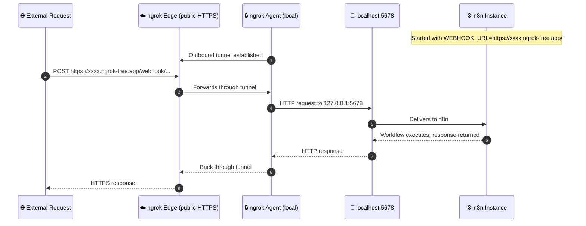
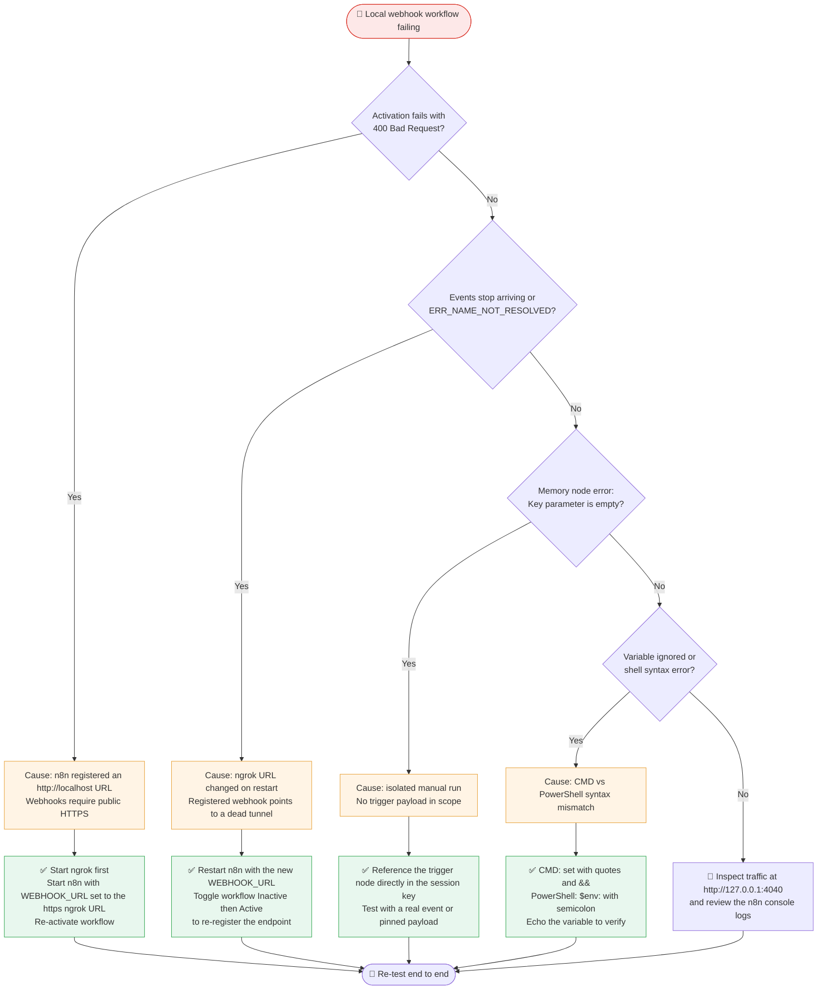

<div align="center">

# 🚇 Local n8n Self-Hosting & Tunneling Deployment

**Zero-cost, unlimited workflow execution: n8n on your own machine, reachable from the internet through an ngrok HTTPS tunnel.**

[](https://n8n.io)
[](https://ngrok.com)
[](https://nodejs.org)
[](LICENSE)

</div>

---

## 📌 Executive Summary

n8n Cloud meters workflow executions and reserves higher volumes for paid tiers. That is a poor fit for developers who test and iterate constantly.

This case study documents how we moved to a **self-hosted n8n instance** (`npx n8n start`) and solved the one problem that makes local setups awkward: **external services need a public HTTPS URL to deliver webhooks, and `localhost` is neither public nor HTTPS.** An **ngrok** tunnel closes that gap.

| | Before (n8n Cloud) | After (local + ngrok) |
|---|---|---|
| **Executions** | Capped by plan | Unlimited, bound only by your hardware |
| **Cost** | Paid tiers for more volume | Free |
| **Webhook reachability** | Built in | Via ngrok tunnel + `WEBHOOK_URL` |
| **Data location** | Vendor cloud | Your machine |

> [!NOTE]
> **Scope of "zero-cost":** this removes n8n Cloud's execution limits. Third-party services your workflows call (for example, paid APIs) keep their own pricing and rate limits. n8n is distributed under the [Sustainable Use License](https://docs.n8n.io/sustainable-use-license/), which permits self-hosting for personal and internal use.

---

## 🏗️ Infrastructure Architecture

n8n listens on **`localhost:5678`**, a port no outside service can reach. ngrok runs beside it, holds an outbound connection to ngrok's edge, and forwards any request arriving at its public HTTPS URL down that connection to port 5678. Setting `WEBHOOK_URL` tells n8n to advertise the **public** address, not `localhost`, when it registers webhooks.



**Why this works:**

- 🔐 **TLS is terminated at ngrok's edge**, so external callers always see valid HTTPS.
- 🔁 **The tunnel is outbound-only.** No router port-forwarding or firewall changes needed.
- 🧭 **`WEBHOOK_URL` fixes the advertised address**, so the URLs n8n registers are reachable from outside.

---

## 💻 Hardware & System Requirements

| Resource | Minimum | Recommended |
|---|---|---|
| **CPU** | Dual-core | Quad-core |
| **RAM** | 4 GB | 8 GB+ |
| **Runtime** | Node.js **v18+** | Latest LTS supported by your n8n version |
| **Network** | Stable internet connection | Wired or strong Wi-Fi |
| **Accounts** | Free ngrok account + authtoken | Reserved ngrok domain (optional) |
| **OS** | Windows, macOS, or Linux | Any |

Verify Node.js before starting:

```bash
node -v
```

---

## 🚀 Step-by-Step Self-Hosting Execution

Open **two terminal windows**. Keep both running.

### One-time setup: register your ngrok authtoken

```bash
npx ngrok config add-authtoken <YOUR_NGROK_AUTHTOKEN>
```

### Command 1 · Launch the tunnel (Terminal 1)

```bash
npx ngrok http 5678
```

Copy the HTTPS address from the output:

```text
Forwarding   https://a1b2-203-0-113-7.ngrok-free.app -> http://localhost:5678
```

### Command 2 · Start n8n with the public `WEBHOOK_URL` (Terminal 2)

Paste the ngrok address, **including the trailing `/`**.

<table>
<tr><th>Shell</th><th>Command</th></tr>
<tr><td><b>CMD</b></td><td>

```bat
set "WEBHOOK_URL=https://a1b2-203-0-113-7.ngrok-free.app/" && npx n8n start
```

</td></tr>
<tr><td><b>PowerShell</b></td><td>

```powershell
$env:WEBHOOK_URL="https://a1b2-203-0-113-7.ngrok-free.app/"; npx n8n start
```

</td></tr>
<tr><td><b>macOS / Linux</b></td><td>

```bash
WEBHOOK_URL="https://a1b2-203-0-113-7.ngrok-free.app/" npx n8n start
```

</td></tr>
</table>

n8n is now running at **http://localhost:5678**.

### Step 3 · Activate the workflow in the n8n UI

1. Open `http://localhost:5678` and create the owner account on first launch.
2. Open your workflow and confirm the trigger's **Production URL** starts with your `https://...ngrok-free.app` address.
3. Toggle the workflow **Active** (or **Publish**, depending on your n8n version).
4. The webhook is now registered with the external service and the setup is live.

> [!IMPORTANT]
> Webhooks are registered **at activation time**. Every time the tunnel URL changes, you must restart n8n with the new `WEBHOOK_URL` **and** re-activate the workflow. See [Issue 2](#issue-2--stale-webhooks--dead-tunnels-err_name_not_resolved).

> [!TIP]
> **Avoid the changing URL entirely:** ngrok accounts can reserve a static domain. Start the tunnel with `npx ngrok http --url=<your-domain>.ngrok-free.app 5678` and the URL never changes. Check ngrok's docs for current free-tier allowances and flag syntax.

---

## 🛠️ Deep-Dive Troubleshooting & Local Edge Cases

### Diagnostic Flowchart



> [!TIP]
> **ngrok Inspector** at `http://127.0.0.1:4040` logs every request reaching your tunnel. If an expected request never appears there, the problem is upstream of n8n.

---

### Issue 1 · HTTPS Webhook Rejection (`400 Bad Request`)

| | |
|---|---|
| **Symptom** | Activating a workflow with an external trigger fails with `400 Bad Request`; the service reports that an HTTPS URL is required. |
| **Cause** | n8n is bound directly to `http://localhost:5678` with no SSL. External services reject non-public, non-HTTPS webhook URLs. |
| **Fix** | Run ngrok, then start n8n with `WEBHOOK_URL` set to the ngrok HTTPS address. n8n now registers the tunnel URL. |

✅ **Verify:** the trigger node's **Production URL** begins with `https://...ngrok-free.app`, not `http://localhost`.

---

### Issue 2 · Stale Webhooks / Dead Tunnels (`ERR_NAME_NOT_RESOLVED`)

| | |
|---|---|
| **Symptom** | Events stop arriving after a restart; opening the old webhook URL shows `ERR_NAME_NOT_RESOLVED`. |
| **Cause** | The free-tier ngrok URL changes whenever the tunnel restarts. The external service still holds the previous URL. |
| **Fix** | Restart n8n with the new `WEBHOOK_URL`, then **toggle the workflow Inactive → Active (or Unpublish → Publish)** to re-register the endpoint. |

> [!IMPORTANT]
> Restarting n8n alone does not update the external service. Only re-activation triggers a fresh webhook registration.

---

### Issue 3 · Memory Node Parameter Failure (`Key parameter is empty`)

| | |
|---|---|
| **Symptom** | A memory node fails with `Key parameter is empty` during testing. |
| **Cause** | The session key is built from trigger data, but the node was run in isolation (a manual "Execute step") with no payload in the current execution. |
| **Fix** | Reference the parent trigger node directly in the key expression, and test with real or pinned trigger data. |

```text
{{ $('Telegram Trigger').item.json.message.chat.id }}
```

- Click **Listen for test event** on the trigger, then send a real message, **or**
- **Pin** a captured trigger payload so downstream nodes always resolve.

---

### Issue 4 · Environment Variable Syntax Mismatches

| | |
|---|---|
| **Symptom** | `WEBHOOK_URL` is ignored (n8n still shows `localhost` URLs) or the shell throws a syntax error. |
| **Cause** | Windows CMD and PowerShell define environment variables differently. |
| **Fix** | Use the syntax that matches your shell. |

| Shell | Syntax |
|---|---|
| **CMD** | `set "WEBHOOK_URL=https://xxxx.ngrok-free.app/" && npx n8n start` |
| **PowerShell** | `$env:WEBHOOK_URL="https://xxxx.ngrok-free.app/"; npx n8n start` |
| **bash / zsh** | `WEBHOOK_URL="https://xxxx.ngrok-free.app/" npx n8n start` |

**Common mistakes**

- ❌ Using `set` in PowerShell (use `$env:`)
- ❌ Using `&&` in Windows PowerShell 5.1 (use `;`)
- ❌ Omitting quotes in CMD, which can capture a trailing space in the value
- ❌ Forgetting the trailing `/` on the URL

**Verify the variable before launching n8n**

```bat
:: CMD
echo %WEBHOOK_URL%
```

```powershell
# PowerShell
echo $env:WEBHOOK_URL
```

---

## 🔒 Security Notes

- The tunnel is **public**: anyone with the URL can reach your n8n login page. Always set a strong owner password.
- Never commit ngrok authtokens or service credentials. Use n8n's credential store.
- Close the tunnel when you are not testing.

---

## 🧪 Example Reference Application

This local deployment setup was tested using the [Evergarden AI Assistant](https://github.com/Stephanie0i/Evergarden-Personal-Assistant) workflow.

---

## 📄 License

Released under the **MIT License**. See [LICENSE](LICENSE) for details.

<div align="center">

<sub>Found a new edge case? Open an issue or PR. Contributions to the troubleshooting guide are welcome.</sub>

</div>

